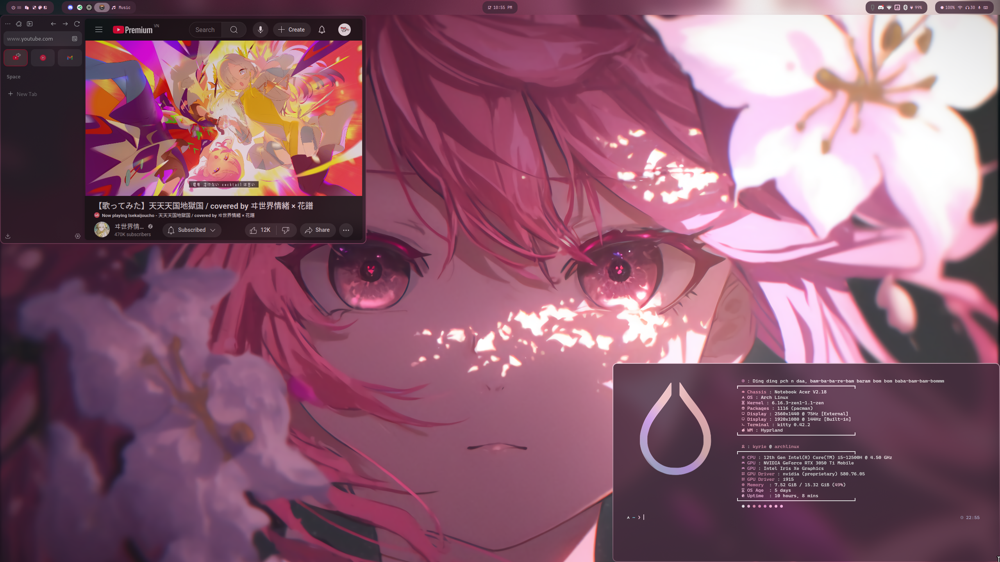

# dotfiles

Collection of dotfiles used for my personal setup


<details>
  <summary>More screenshots</summary>
  
  
</details>

This setup mainly uses configurations that are meant for Arch Linux + [HyDE](https://github.com/HyDE-Project/HyDE)/Hyprland, tailored to my personal needs.

This will get updated from time to time as I tweak my setup (or when I remember that I tweaked my setup).

> [!WARNING]\
> **DO NOT** blindly copy these configurations, otherwise your system might not work as intended, or even boot.\
> Know what you're doing and adapt them to your own needs.

# repository structure

```
. /
├── config/
├── discord/
├── hyprland/
│   ├── scripts/
│   └── pkg_user.lst
├── modprobe/
├── systemd/
├── udev/
└── zsh/
```

- `config/` - contains configurations for other applications
- `discord/` - QuickCSS and stuff
- `hyprland/` - contains configurations for Hyprland and related applications
  - `scripts/` - useful scripts for Hyprland keybinds
  - `pkg_user.lst` - list of packages to install to get you started as quickly as possible
- `modprobe/` - contains modprobe configurations
- `systemd/` - contains systemd service files
- `udev/` - contains udev rules
- `zsh/` - zsh configurations

# useful resources

- [HyDE](https://github.com/HyDE-Project/HyDE) - Hyprland Desktop Environment, a full-featured desktop environment based on Hyprland
  - [HyDE Themes](https://github.com/HyDE-Project/hyde-themes) - community themes for HyDE
- [Hyprland Wiki](https://wiki.hyprland.org/) - official wiki for Hyprland
- [ALHP](https://somegit.dev/ALHP/ALHP.GO) - Arch Linux prebuilt & optimized packages mirror
- [Rapidfox](https://github.com/Eratas/rapidfox/wiki) - Firefox(-based) optimization guide
  - set `zen.widget.linux.transparency` to `true` for the transparency effect on Zen browser
- [Proton guide for NTFS](https://github.com/ValveSoftware/Proton/wiki/Using-a-NTFS-disk-with-Linux-and-Windows) - guide to set up NTFS drives for Proton games, useful for Windows dual-boot users
